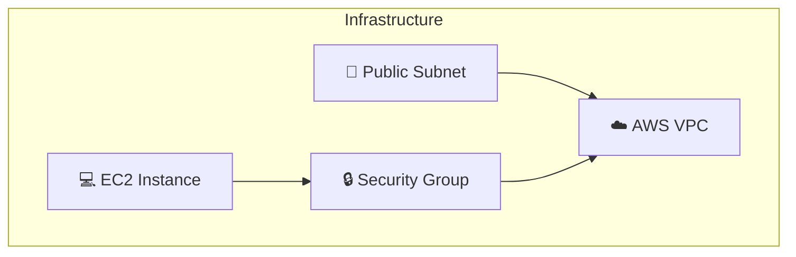

# Infrastructure Diagram Generation

InfraPilot now generates high-level infrastructure diagrams from Terraform code automatically!

## 🎨 Supported Diagram Formats

### 1. **ASCII Diagram**
- Tree-based representation
- Shows all resources and their properties
- Perfect for terminal/documentation
- Quick to generate

**Example:**
```
================================================================
  🏗️  AWS INFRASTRUCTURE DIAGRAM
================================================================

┌─ 🔗 vpc
│  ├─ main
│  │  └─ enable_dns_hostnames: true
│
┌─ 📡 subnet
│  ├─ public
│  │  └─ availability_zone: us-east-1a
│
┌─ 🔒 security_group
│  ├─ allow_http
│  │  └─ description: Allow HTTP traffic
│
┌─ 💻 instance
│  ├─ web_server
│  │  └─ instance_type: t2.micro
│
================================================================
```

### 2. **Mermaid Diagram**
- Visual graph representation
- Can be rendered in GitHub/GitLab/Notion
- Shows resource relationships
- Web-based visualization

**Example Output:**


### 3. **JSON Format**
- Structured data representation
- Machine-readable for processing
- Includes metadata and properties
- Custom rendering support

**Example:**
```json
{
  "provider": "aws",
  "resources": [
    {
      "id": "aws_vpc:main",
      "type": "aws_vpc",
      "name": "main",
      "icon": "🔗",
      "properties": {
        "cidr_block": "10.0.0.0/16",
        "enable_dns_hostnames": "true"
      }
    }
  ],
  "total_resources": 4
}
```

### 4. **SVG Diagram**
- Vector graphics format
- Scalable and printable
- Interactive capabilities
- Professional appearance

## 🚀 How to Use

### In the Web UI

1. **Generate IaC** by entering your infrastructure description
2. Click on the **"Diagram"** tab in the results panel
3. Select your preferred diagram type (ASCII, Mermaid, JSON, SVG)
4. Click **"Generate [TYPE] Diagram"**
5. View the generated diagram

### Via API

```bash
curl -X POST http://localhost:8001/api/v1/diagram/generate-diagram \
  -H "Content-Type: application/json" \
  -d '{
    "terraform_code": "resource \"aws_vpc\" \"main\" { ... }",
    "diagram_type": "mermaid"
  }'
```

### Supported Diagram Types

```bash
curl http://localhost:8001/api/v1/diagram/diagram-formats
```

## 📊 Resource Icons

| Resource Type | Icon | Example |
|--------------|------|---------|
| Instance/Server | 💻 | EC2, Compute |
| VPC/Network | 🔗 | VPC, Network |
| Subnet | 📡 | Subnet |
| Security Group | 🔒 | Security Group |
| Load Balancer | ⚖️ | ALB, NLB |
| Database | 🗄️ | RDS, DynamoDB |
| Storage | 🪣 | S3, Bucket |
| Lambda | ⚡ | Lambda Function |
| API Gateway | 🌐 | API Gateway |
| IAM Role | 👤 | IAM Role |
| Route | 🛣️ | Route |
| NAT Gateway | 🚪 | NAT Gateway |

## 🎯 Use Cases

### Documentation
- Generate diagrams for architecture documentation
- Include in README files and design documents
- Share with team members

### Presentations
- Export SVG diagrams for presentations
- Use Mermaid for live demos
- Show infrastructure at a glance

### Design Review
- Visualize infrastructure before deployment
- Share with stakeholders
- Validate design decisions

### Git Repository
- Commit Mermaid diagrams to Git
- Auto-render in GitHub/GitLab
- Track infrastructure changes

## 🔄 Workflow

```
User Input (Natural Language)
        ↓
Generate Terraform Code (IaC)
        ↓
Parse Terraform Syntax
        ↓
Extract Resources & Properties
        ↓
Generate Diagram (ASCII/Mermaid/JSON/SVG)
        ↓
Display in UI / Return via API
```

## 💡 Tips & Tricks

### ASCII Diagram
- Best for quick terminal viewing
- Lightweight format
- Copy-paste friendly

### Mermaid Diagram
- Paste into GitHub Issues/PRs
- Perfect for documentation
- Version control friendly
- Click [mermaid.live](https://mermaid.live) to edit

### JSON Format
- Process with custom tools
- Build custom dashboards
- Integrate with other systems

### SVG Diagram
- Professional appearance
- Print-friendly
- Interactive features possible

## 🔌 Integration Examples

### GitHub README
```markdown
# Infrastructure

## Architecture Diagram

```mermaid
[Paste Mermaid output here]
```

## Resources

- VPC: 10.0.0.0/16
- Subnets: 10.0.1.0/24, 10.0.2.0/24
- Instances: 2x t2.micro
```

### GitLab Wiki
- Same Mermaid integration
- View in Wiki pages
- Edit inline

### Notion
- Copy SVG and paste
- Embed Mermaid with plugin
- Create architecture database

## 🛠️ API Reference

### Generate Diagram Endpoint

```
POST /api/v1/diagram/generate-diagram
```

**Request:**
```json
{
  "terraform_code": "resource \"aws_vpc\" \"main\" { ... }",
  "diagram_type": "ascii|mermaid|json|svg"
}
```

**Response:**
```json
{
  "success": true,
  "diagram_type": "mermaid",
  "content": "graph TB...",
  "metadata": {
    "provider": "aws",
    "resources_count": 5,
    "resource_types": ["aws_vpc", "aws_subnet", "aws_instance", ...]
  }
}
```

### Get Supported Formats

```
GET /api/v1/diagram/diagram-formats
```

**Response:**
```json
{
  "formats": [
    {
      "type": "ascii",
      "description": "ASCII art infrastructure diagram",
      "best_for": "Terminal viewing, documentation",
      "example": "Tree structure with resource details"
    },
    ...
  ]
}
```

## ❓ FAQ

**Q: Can I edit the diagram?**
A: For Mermaid, yes! Copy the code to [mermaid.live](https://mermaid.live) to edit.

**Q: Which format should I use?**
A: Use ASCII for quick viewing, Mermaid for GitHub/docs, SVG for presentations.

**Q: Are custom resource icons supported?**
A: The system automatically matches icons based on resource type. Custom icons coming soon!

**Q: Can I export diagrams?**
A: Yes! All formats can be copied and exported to files.

---

**Diagram generation is instant and automatically included in all IaC outputs!**
