# 🚀 Quick Start - PNG & Lucidchart Features

## What's New

✨ **PNG Images Fixed** - Now displays diagrams as actual images  
✨ **Lucidchart Support** - New diagram format optimized for Lucidchart import

---

## How to Use PNG Diagrams

### Step 1: Generate Infrastructure
```
Open: http://localhost:3001
Enter: "Create Azure VM with resource group and NSG"
Click: "Generate Infrastructure"
Wait: 2-3 minutes
```

### Step 2: View Diagram
```
Click: "Diagram" tab
Select: "PNG 🖼️" button
Click: "Generate PNG"
Result: Beautiful diagram image appears!
```

### Step 3: Use Your Diagram
```
Download: Save to computer
Copy: Send via email/chat
Share: Include in presentations
Print: Professional output
```

---

## How to Use Lucidchart Diagrams

### Step 1: Generate Infrastructure
```
Open: http://localhost:3001
Enter: Infrastructure description
Click: "Generate Infrastructure"
Wait: 2-3 minutes
```

### Step 2: Generate Lucidchart Code
```
Click: "Diagram" tab
Select: "LUCIDCHART 📊" button (new!)
Click: "Generate LUCIDCHART"
Result: Mermaid code optimized for Lucidchart
```

### Step 3: Import to Lucidchart
```
Copy: Click "Copy" button
Go to: https://lucidchart.com
New Diagram: Click "Create Document"
Import Mermaid: Select Mermaid import option
Paste Code: Paste the copied code
Click: "Import"
Customize: Edit in professional editor
```

---

## Available Diagram Types

| Button | Type | Use When |
|--------|------|----------|
| SVG 📊 | Vector | Want scalable graphics |
| HTML 🎨 | Interactive | Need clickable details |
| PNG 🖼️ | Image | Sharing or presenting |
| ASCII | Text | Terminal viewing |
| **LUCIDCHART** | **Mermaid** | **Making professional diagrams** |
| MERMAID | Mermaid | GitHub/GitLab sharing |
| JSON | Data | API integration |

---

## Example Lucidchart Output

### Generated Mermaid Code:

```mermaid
graph TD
    n1["🔵 myResourceGroup<br/>(azurerm_resource_group)"]
    n2["💻 myVM<br/>(azurerm_virtual_machine)"]
    n3["🔒 myNSG<br/>(azurerm_network_security_group)"]
    n2 --> n1
    n3 --> n1
```


### In Lucidchart:
- Automatically layouts as professional diagram
- Color-coded by resource type
- Relationships shown clearly
- Fully editable in Lucidchart UI
- Export to various formats (PDF, PNG, SVG, etc.)

---

## PNG Image Display

### Before Fix:
```
Blank white area with loading spinner
Image not appearing
```

### After Fix:
```
Professional infrastructure diagram
Color-coded resource boxes
Clear labels and information
Ready to share/print
```

---

## Download & Share

### PNG Files:
1. Generate PNG diagram
2. Click "📥 Download" button
3. Save to computer (infrastructure-diagram.png)
4. Share via email, Slack, Teams, etc.
5. Include in PowerPoint presentations

### Lucidchart Diagrams:
1. Generate Lucidchart code
2. Click "📋 Copy" button
3. Paste into Lucidchart
4. Edit professionally
5. Export as needed

---

## Quick Reference

**What I fixed:**
- ✅ PNG images now display correctly
- ✅ Added Lucidchart-compatible Mermaid format
- ✅ Better error handling in image generation
- ✅ Frontend buttons for new features

**Where to find help:**
- PNG issues? → Try SVG or HTML format
- Lucidchart not importing? → Check code syntax
- Diagram looks wrong? → Regenerate with simpler infrastructure
- Want different format? → Try another diagram type

---

## Keyboard Shortcuts

| Action | Shortcut |
|--------|----------|
| Copy | Ctrl+C (after clicking Copy button) |
| Download | Already has download button |
| Refresh browser | F5 or Ctrl+R |
| Switch tabs | Click tab buttons |

---

## Browser Compatibility

✅ Chrome/Edge - Full support  
✅ Firefox - Full support  
✅ Safari - Full support  
✅ Mobile browsers - Responsive design  

---

## Troubleshooting

### PNG not showing?
1. Click "Generate PNG" again
2. Try refreshing page (F5)
3. Check browser console (F12)
4. Try PNG 🖼️ button again

### Lucidchart code not importing?
1. Make sure code is fully copied
2. Paste into Mermaid section in Lucidchart
3. Check for special characters in resource names
4. Try simpler infrastructure first

### Buttons not working?
1. Ensure IaC was generated first
2. Refresh the page
3. Click "Diagram" tab
4. Select format and generate

---

## Next Steps

1. **Generate infrastructure** at localhost:3001
2. **Try PNG format** for images
3. **Try Lucidchart** for professional diagrams
4. **Share with team** using download or export features
5. **Enjoy automated diagrams!** ✨

---

## Support

**Questions?**
- Check `PNG_AND_LUCIDCHART_FIX.md` for detailed documentation
- Refer to `DIAGRAM_READY.md` for all diagram features
- See `README_QUICK.md` for general help

---

**Ready to create beautiful infrastructure diagrams!** 🎉
